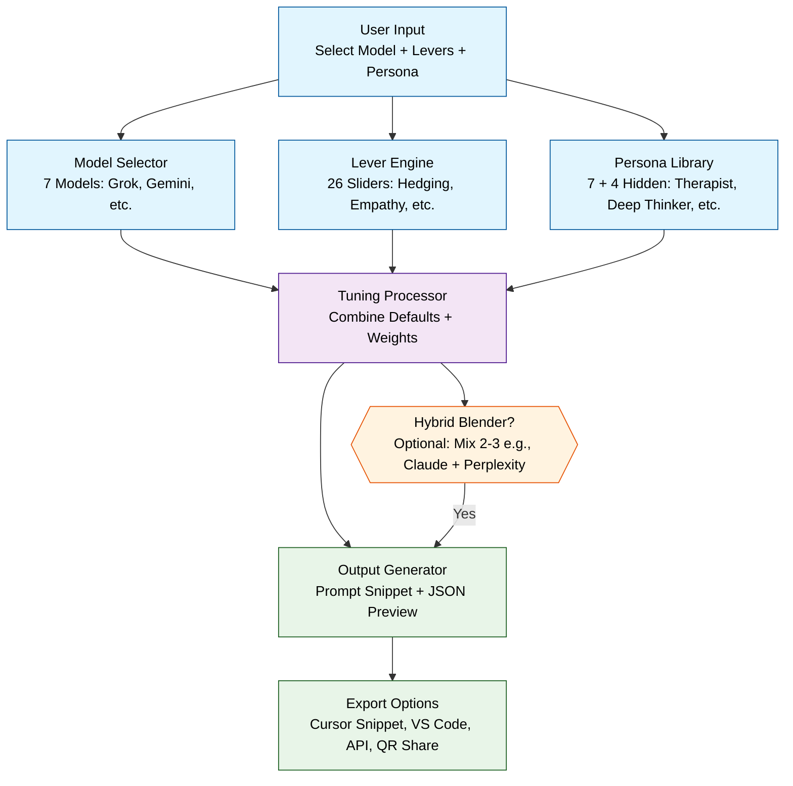

# AI Tuner Flowchart

## System Architecture Flow

## Legend

- **Blue (Input)**: User input and initial selection components
- **Purple (Core)**: Core processing engine
- **Orange (Optional)**: Optional hybrid blending feature
- **Green (Output)**: Output generation and export options

## Component Details

### Input Layer
- **User Input**: Model selection, lever adjustments, persona choice
- **Model Selector**: 7 models (Grok, Gemini, Claude, ChatGPT, Perplexity, Mistral, Llama 3.1)
- **Lever Engine**: 26 tuning sliders (Hedging, Empathy, Formality, etc.)
- **Persona Library**: 7 core personas + 4 hidden modes (11 total)

### Processing Layer
- **Tuning Processor**: Combines model defaults, lever weights, and persona settings
- **Hybrid Blender**: Optional feature to mix 2-3 models/personas

### Output Layer
- **Output Generator**: Creates prompt snippet and JSON preview
- **Export Options**: Cursor snippet, VS Code integration, API, QR code sharing

